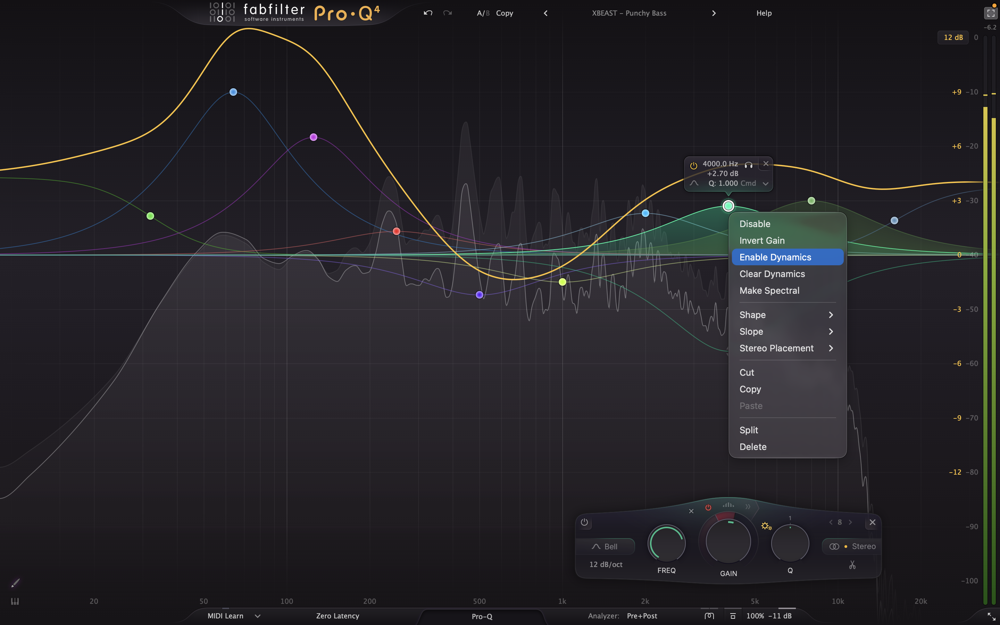
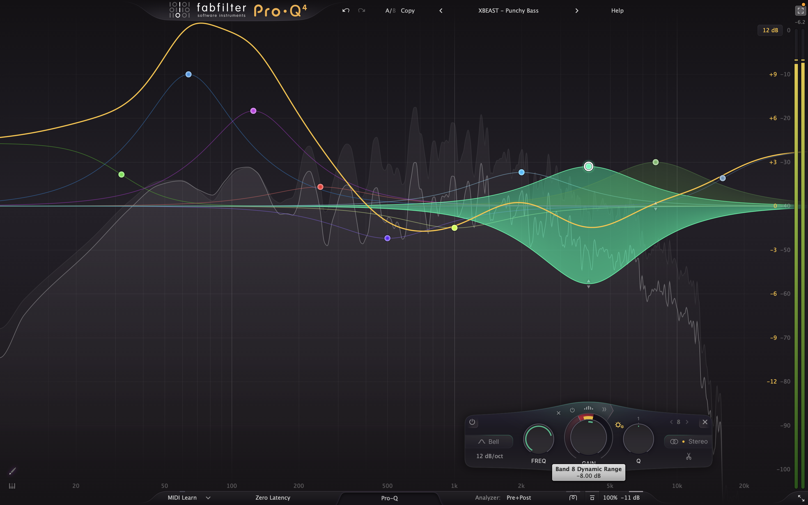

# FabFilter Pro-Q: Simple Guide to Massive Bass, Dynamic Precision & Clean Sound

A simple, plain-English guide for music lovers, audiophiles, and competitive gamers. Universal for any in-ear monitors (IEMs), headphones, or speakers. Just practical knowledge on how headroom works, how Q-factor and Gain-Q interaction sculpt clean punch, why 10 bands is the sweet spot, how Dynamic EQ tames harsh spikes, and how to set up clean live audio routing on Mac and Windows.

---

## Table of Contents
1. [1. The Headroom Secret: Why Did My Bass Crackle?](#1-the-headroom-secret-why-did-my-bass-crackle)
   - [The Water Glass Analogy](#the-water-glass-analogy)
   - [Why Lowering the Output Slider Fixed It](#why-lowering-the-output-slider-fixed-it)
   - [The Golden Rule of Headroom](#the-golden-rule-of-headroom)
   - [Computer Audio vs. Your Hardware DAC (Why Output Still Clips)](#computer-audio-vs-your-hardware-dac-why-output-still-clips)
2. [2. The Plain-English Frequency Map: What Every Range Does](#2-the-plain-english-frequency-map-what-every-range-does)
   - [Visual Sound Spectrum](#visual-sound-spectrum)
   - [The 6 Sound Zones Explained Simply](#the-6-sound-zones-explained-simply)
3. [3. The Secret Behind the V-Shape (The Smile Curve)](#3-the-secret-behind-the-v-shape-the-smile-curve)
4. [4. Hardware Matching: IEMs vs. Over-Ear Headphones](#4-hardware-matching-iems-vs-over-ear-headphones)
   - [In-Ear Monitors (IEMs) and The Ear Tip Seal](#in-ear-monitors-iems-and-the-ear-tip-seal)
   - [Over-Ear Headphones (Closed vs. Open Back)](#over-ear-headphones-closed-vs-open-back)
   - [Single Dynamic Driver vs. Multi-Driver IEMs](#single-dynamic-driver-vs-multi-driver-iems)
5. [5. Band Count Guide: Why 8 to 10 Bands is the Sweet Spot](#5-band-count-guide-why-8-to-10-bands-is-the-sweet-spot)
   - [Why More Bands (16 to 32) Actually Ruin Your Sound](#why-more-bands-16-to-32-actually-ruin-your-sound)
   - [The Linear Phase Trap: The Pre-Ringing "Whoosh"](#the-linear-phase-trap-the-pre-ringing-whoosh)
6. [6. The Q-Factor Guide: What It Does and Which Setting to Choose](#6-the-q-factor-guide-what-it-does-and-which-setting-to-choose)
   - [What is Q-Factor: Plain-English Width Explained](#what-is-q-factor-plain-english-width-explained)
   - [The Core Acoustic Choice: Tight Punch vs Physical Vibration](#the-core-acoustic-choice-tight-punch-vs-physical-vibration)
   - [The Needle Trap: Why Extreme Boosts Should Never Have High Q](#the-needle-trap-why-extreme-boosts-should-never-have-high-q)
   - [The Clear Decision Table: What Q to Use for Each Preset](#the-clear-decision-table-what-q-to-use-for-each-preset)
   - [Should You Use Automatic Gain-Q Interaction?](#should-you-use-automatic-gain-q-interaction)
   - [The Golden Rule: Trust Your Ears Over Formulas](#the-golden-rule-trust-your-ears-over-formulas)
   - [Pro-Q Secret Shortcut: Fine Adjustment Mode by Holding Shift](#pro-q-secret-shortcut-fine-adjustment-mode-by-holding-shift)
7. [7. Dynamic EQ: The Secret Weapon for Harsh Spikes and Boomy Drops](#7-dynamic-eq-the-secret-weapon-for-harsh-spikes-and-boomy-drops)
   - [What is Dynamic EQ and Why It Beats a Regular Static Cut](#what-is-dynamic-eq-and-why-it-beats-a-regular-static-cut)
   - [How to Set Up a Dynamic Band in Pro-Q (Interface and Screenshots)](#how-to-set-up-a-dynamic-band-in-pro-q-interface-and-screenshots)
   - [The 10-Second Solo Sweep Trick (Finding the Pain Point)](#the-10-second-solo-sweep-trick-finding-the-pain-point)
   - [Fix 1: Taming Piercing Sibilance, Plate Reverb and Cymbals (5 to 8 kHz)](#fix-1-taming-piercing-sibilance-plate-reverb-and-cymbals-5-to-8-khz)
   - [Fix 2: Taming Boomy Bass on Heavy Drops (140 to 200 Hz)](#fix-2-taming-boomy-bass-on-heavy-drops-140-to-200-hz)
   - [Dynamic EQ Quick Settings Cheat Sheet](#dynamic-eq-quick-settings-cheat-sheet)
8. [8. Live System Routing: SoundSource (Mac) and Equalizer APO (Windows)](#8-live-system-routing-soundsource-mac-and-equalizer-apo-windows)
   - [The Master Signal Chain Order](#the-master-signal-chain-order)
   - [Why Pro-Q Goes First and Pro-L 2 Goes Last](#why-pro-q-goes-first-and-pro-l-2-goes-last)
   - [Do You Need a Separate Compressor (Pro-C 2)?](#do-you-need-a-separate-compressor-pro-c-2)
   - [Crucial Zero-Latency Settings for Gaming and Videos](#crucial-zero-latency-settings-for-gaming-and-videos)
   - [Mac Setup: SoundSource](#mac-setup-soundsource)
   - [Windows Setup: Equalizer APO and Peace](#windows-setup-equalizer-apo-and-peace)
   - [Quick Problem Solver](#quick-problem-solver)
9. [9. The 3-Plugin Power Trio and Next Steps](#9-the-3-plugin-power-trio-and-next-steps)
   - [Pro-Q, Pro-R 2 and Pro-L 2: Complete Audio Control](#pro-q-pro-r-2-and-pro-l-2-complete-audio-control)
   - [Companion Guides](#companion-guides)

---

## 1. The Headroom Secret: Why Did My Bass Crackle?

You may have encountered this: you opened FabFilter Pro-Q, boosted the low frequencies up by **+10 dB to +13 dB** for heavy sub-bass, hit play, and heard horrible scratchy crackling, buzzing, and distortion.

Then, you pulled down the Output slider in the bottom-right corner of Pro-Q to **-10 dB or -15 dB**, and instantly the crackling disappeared and the sound became smooth and clean.

Here is why that happens in simple terms.

---

### The Water Glass Analogy

Think of a normal mastered song as a **glass filled precisely to the brim with water**:

```
    DIGITAL 0 dB CEILING (Top of the Glass)
    ┌─────────────────────────────────────────┐ ~ ~ ~ MAXIMUM WATER LEVEL (0 dB)
    │  ~ ~ ~ ~ ~ ~ ~ ~ ~ ~ ~ ~ ~ ~ ~ ~ ~ ~ ~  │ 
    │  Cymbals & Air       (High Frequencies) │ 
    │  Vocals & Guitars    (Mid Frequencies)  │ 
    │  Bass & Kicks        (Low Frequencies)  │ 
    └─────────────────────────────────────────┘
             STANDARD SONG (Clean & Full)
```

In digital audio, the absolute maximum limit is **0 dB**. Sound cannot go above 0 dB—there are simply no numbers left to represent it.

When you add a **+12 dB** bass boost, you are pouring an extra **pitcher of water directly into a full glass**:

```
                  POURING +12 dB EXTRA BASS
                           │   │
                           ▼   ▼
    ================== SPILLOVER! ==================  DISTORTION / CRACKLE
    ┌─────────────────/\─/\─/\────────────────┐       (Digital Clipping)
    │  ~ ~ ~ ~ ~ ~ ~ /  \  /  \ ~ ~ ~ ~ ~ ~ ~ │ 
    │  Cymbals & Air       (High Frequencies) │ 
    │  Vocals & Guitars    (Mid Frequencies)  │ 
    │  BASS MASSIVELY OVERFLOWING (+12 dB)    │ 
    └─────────────────────────────────────────┘
```

Because the digital container cannot expand, the audio waves slam into the ceiling and get chopped off flat into square waves. This is called **digital clipping**, and it produces painful, scratchy buzzing distortion.

---

### Why Lowering the Output Slider Fixed It

When you pull the Output slider down to **-15 dB**, you lower the overall water level inside the glass *before* the bass hits:

```
    DIGITAL 0 dB CEILING (Top of the Glass)
    ┌─────────────────────────────────────────┐ ◄── Top Rim (0 dB)
    │                                         │
    │         [+2 dB SAFETY BUFFER]           │ ◄── Clean Headroom
    │             /\                          │
    │  ~ ~ ~ ~ ~ /  \ ~ ~ ~ ~ ~ ~ ~ ~ ~ ~ ~ ~ │ ◄── Giant +13 dB bass wave fits!
    │  Cymbals  /    \                        │
    │  Vocals & Guitars (Attenuated by 15 dB) │
    │  Bass wave fits completely inside!      │
    └─────────────────────────────────────────┘
           PRE-AMP AT -15 dB (Zero Distortion!)
```

This empty space is called **headroom**. Now your massive bass boost has plenty of room to peak safely without touching the ceiling. **Zero clipping, zero crackle.**

> [!WARNING]
> **The Trade-Off:** The Output slider lowers the **entire song equally**. Vocals, guitars, and drums also get quieter by that same amount. To restore commercial listening volume without re-introducing distortion, you pair Pro-Q with a limiter (like Pro-L 2), as shown in Section 8.

---

### The Golden Rule of Headroom

You never have to guess where to set your Output slider. Follow this simple rule:

> [!IMPORTANT]
> **THE GOLDEN RULE OF HEADROOM:**  
> **Output Slider (in minus dB) = Your Highest Bass Boost (+ 1 to 2 dB safety buffer)**  
> 
> *If your highest bass band is boosted by +11.5 dB, set your Output slider to **-11 dB** or **-12 dB**.*

| Bass Boost Level | Ideal Output Slider Setting | Result |
| :--- | :---: | :--- |
| **Light Boost (+6 to +8 dB)** | **`-8 dB`** | Safe headroom for subtle warmth. |
| **Heavy Boost (+10 to +11.5 dB)** | **`-11 dB`** | Sweet spot for energetic, punchy daily listening. |
| **Extreme Boost (+12 to +14 dB)** | **`-15 dB`** | Rock-solid protection for massive sub-bass drops. |

---

### Computer Audio vs. Your Hardware DAC (Why Output Still Clips)

Inside your computer, software plugins can handle volume peaks above 0 dB without distorting each other. 

However, your physical **DAC (Digital-to-Analog Converter)**—whether it's your laptop headphone jack, an Apple dongle, or a high-end DAC/Amp like the JCALLY JM98MAX—is a physical hardware device. It has a strict, hard electrical limit at 0 dB. If an audio signal leaves your software above 0 dB, your DAC hardware will brutally chop off the sound waves, causing instant distortion in your headphones. 

Always keep the final signal exiting your software below 0 dB (or protected by a limiter).

---

## 2. The Plain-English Frequency Map: What Every Range Does

Sound frequency is measured in **Hertz (Hz)** and **Kilohertz (kHz)**, from deep earthquake rumble (20 Hz) up to sparkling air (20,000 Hz / 20 kHz).

---

### Visual Sound Spectrum

| Sound Zone | **SUB-BASS**<br>*(20 – 60 Hz)* | **BASS**<br>*(60 – 150 Hz)* | **MUD ZONE**<br>*(150 – 500 Hz)* | **VOCALS / MIDS**<br>*(500 Hz – 2 kHz)* | **TREBLE**<br>*(2 – 8 kHz)* | **AIR / SPARKLE**<br>*(8 – 20 kHz)* |
| :--- | :---: | :---: | :---: | :---: | :---: | :---: |
| **Acoustic Feel** | Chest Rumble & Vibration | Kick Thump & 808s | Cardboard / Hollow Box | Human Voice & Melody | Drum Snap & Cymbals | Open Sheen & Shimmer |
| **Tuning Action** | **▲ BOOST** | **▲ BOOST** | **▼ SCOOP / CUT** | **— NATURAL** | **▲ BOOST** | **▲ BOOST** |
| **Sonic Result** | Deep Physical Weight | Body Punch & Slam | Removes Mud & Haze | Clear, Intimate Vocals | Sharp Detail & Bite | Open, Wide Soundstage |

---

### The 6 Sound Zones Explained Simply

#### 1. 20 Hz – 60 Hz: Sub-Bass (The Physical Rumble)
- **What it feels like:** The earthquake vibration in movie theaters, the rumble that rattles car panels, and the lowest notes of an 808 bassline.
- **How you experience it:** You feel this physically in your head, chest, and jaw as much as you hear it. Boost this to give modern music heavy physical depth.

#### 2. 60 Hz – 150 Hz: Bass Punch (The Chest Thump)
- **What it feels like:** The punch of a kick drum beater and the rhythmic drive of an electric bass guitar.
- **Role:** Gives music its groove and physical energy. Boosting here makes beats hit hard and punchy.

#### 3. 150 Hz – 500 Hz: The Mud & Cardboard Zone (The Clean-Up Window)
- **What it sounds like:** Speaking with your head inside an empty cardboard box.
- **Why it matters:** Vocals, guitars, keyboards, and bass harmonics all pile up here. If this range is too loud, the song sounds muffled and congested. Scooping this range down by **-2 dB to -3 dB** cleans up the haze and makes everything sound high-end.

#### 4. 500 Hz – 2 kHz: Vocals & Melodic Presence (The Vocal Core)
- **What it sounds like:** The natural body of the human voice and acoustic instruments.
- **Role:** Human ears are most sensitive here. Keep this natural and balanced so singers sound human and intimate without becoming honky or harsh.

#### 5. 2 kHz – 8 kHz: Treble Detail & Snare Snap (Clarity & Definition)
- **What it sounds like:** The sharp snap of a snare drum, acoustic guitar pick clicks, and vocal consonants ("s", "t", "k").
- **Role:** Adds articulation and excitement. A gentle lift brings instruments forward, while a cut here stops piercing ear fatigue.

#### 6. 8 kHz – 20 kHz: Air & Sparkle (Open Room Extension)
- **What it sounds like:** The shimmering tail of cymbals, the breath at the end of a vocal line, and natural room acoustics.
- **Role:** Creates a sense of width, openness, and high fidelity, making headphones sound like an open concert hall rather than a claustrophobic box.

---

## 3. The Secret Behind the V-Shape (The Smile Curve)

The most popular tuning curve for modern music, gaming, and fun listening is the **V-Shape** (often called the **Smile Curve**):

```
 BOOSTED BASS (Weight & Punch)                BOOSTED TREBLE (Air & Sparkle)
       \                                                /
        \                                              /
         \                                            /
          \                                          /
           \─────── SCOOPED MIDS (500 Hz) ──────────/
                     (Clean & Uncongested)
```

**Why it works so well:**
1. **Physical Energy:** Elevated bass delivers fun, punchy low-end impact.
2. **Crystal Clarity:** Scooping out 300–600 Hz mud prevents that heavy bass from clouding the vocals.
3. **Open Balance:** Elevated treble balances the bass weight so music never sounds dull or dark.
4. **Exciting Experience:** Turns flat, boring, clinical sound into an engaging, dynamic performance.

---

## 4. Hardware Matching: IEMs vs. Over-Ear Headphones

---

### In-Ear Monitors (IEMs) and The Ear Tip Seal

In-ear monitors go directly into your ear canal, forming a sealed air chamber measuring less than 2 cm³:
- **Acoustic Pressure:** Because the chamber is airtight, low-frequency sound creates direct acoustic pressure against your eardrum. Deep sub-bass cannot escape.
- **Bass Capability:** IEMs can reproduce huge +12 dB sub-bass boosts with incredible efficiency and depth.
- **The Golden Seal Rule:** If your ear tips do not form a complete airtight seal, sub-bass leaks out instantly, making the IEM sound tinny and thin. Always make sure your ear tips seal properly before adjusting EQ.

---

### Over-Ear Headphones (Closed vs. Open Back)

- **Closed-Back:** Traps low-end energy inside the ear cup. Great for punchy, impactful bass and heavy sub-bass boosts. Ensure a good seal around your ears (thick glasses or long hair can break the pad seal and reduce bass).
- **Open-Back:** Vents freely through the back of the ear cups. Delivers a wide, airy soundstage, but sub-bass naturally rolls off. Applying moderate bass boosts sounds great, but pushing extreme +12 dB sub-bass at high volumes can push single open-back drivers to their physical limits.

---

### Single Dynamic Driver vs. Multi-Driver IEMs

- **Single Dynamic Driver:** One physical speaker diaphragm reproduces everything from 30 Hz sub-rumble to 15,000 Hz cymbal shimmer. Applying an extreme +13 dB sub-bass boost makes that single diaphragm move violently, which can slightly blur delicate vocals (intermodulation distortion). Single-driver gear sounds best with moderate, controlled bass boosts.
- **Multi-Driver Systems (e.g. Dedicated Bass Woofers):** Multi-driver IEMs (like the dual-driver KZ Castor Pro Bass Edition) have a dedicated speaker for deep sub-bass and a separate speaker for vocals and highs. Because vocals are physically isolated from bass vibrations, you can boost sub-bass to massive levels (+13 dB) while vocals stay 100% crystal clear.

---

## 5. Band Count Guide: Why 8 to 10 Bands is the Sweet Spot

Many people wonder: *"Should I use 20 or 32 bands in Pro-Q to flatten every little bump on an IEM measurement graph?"*

The answer is **no**. For music listening on IEMs, **5 to 8 bands is the sweet spot, and 10 bands is the maximum**.

```
   OVER-EQ'D CURVE (24-32 Bands): The Jagged "Sawtooth" Trap
      ▲ dB
      │   /\  /\    /\  /\/\  /\
 0 dB ┼──/  \/  \──/  \/    \/  \────────── Mushy drums, phase smearing, hollow tone
      │          \/
      └───────────────────────────────────► Frequency

   OPTIMAL CURVE (8-10 Bands): Smooth Macroscopic Acoustic Contours
      ▲ dB
      │      Sub-Bass     Ear Gain       Air Shelf
      │      ┌──────┐     ┌──────┐      ┌────────
 0 dB ┼──────┘      \────/        \────/────────── Punchy transients, natural timbre
      │               Mud Scoop
      └───────────────────────────────────► Frequency
```

---

### Why More Bands (16 to 32) Actually Ruin Your Sound

When you stack 20 to 32 narrow filter bands:
1. **Phase Smearing (Mushy Drums):** Every standard EQ filter causes a slight time-delay (phase shift) around its frequency. When you string 25 narrow bands in a row, the timing of transients gets blurred. The sharp, snappy punch of kick drums, snares, and acoustic guitar plucks gets smeared and sounds mushy.
2. **The "Sawtooth" Comb-Filter Trap:** Automated scripts often create a jagged sawtooth pattern of tiny boosts and cuts. In your ears, these overlapping ringing filters interfere with each other, creating an artificial, hollow sound—making vocalists sound like they're singing inside a plastic drainage pipe.
3. **What 16+ Bands Are Actually For:** 20+ bands are meant for measuring room acoustics (fixing bass echoes bouncing between concrete walls in a studio) or live stage sound (stopping a squealing microphone). They were never meant for in-ear headphones!

---

### The Linear Phase Trap: The Pre-Ringing "Whoosh"

Some try to fix phase shifts by switching Pro-Q to **Linear Phase** mode. On IEMs, this introduces a worse problem: **Pre-Ringing**.
- Linear phase filters achieve perfect phase alignment by ringing *both before and after* a sound.
- Our ears naturally ignore ringing that happens *after* a loud drum hit. But our ears cannot ignore sound that happens *before* a hit.
- In multi-band linear phase profiles, you hear an unnatural "whoosh" or hollow pre-echo right before every bass drop and snare hit, draining the punch and punchiness from your music.
- **Rule:** Stick to **Zero Latency** (for gaming and live listening) or **Natural Phase** (for pure music).

---

## 6. The Q-Factor Guide: What It Does and Which Setting to Choose

When equalizing music, gain is only half the story. The other critical dial is **Q-Factor** (Bandwidth). 

Many listeners get confused by conflicting advice: *"Should I make Q narrower? Should I link Q to Gain? Should I keep everything at 1.0?"* 

Here is the plain-English truth about how Q works, what happens when you change it, and the simple rulebook for choosing the right setting for any preset.

---

### What is Q-Factor: Plain-English Width Explained

The **Q-factor** controls the **width** (bandwidth) of an EQ band:
- **Low Q (0.5 – 0.8):** A wide, gentle hill. Affects a broad range of frequencies across several octaves. Great for broad tone warming.
- **Musical Sweet Spot (0.9 – 1.3):** The standard range for music listening. Provides natural, musical curves that blend smoothly across octaves.
- **High Q (1.5 – 3.0+):** A narrow, sharp needle. Affects only a tiny slice of sound. Used for surgical notch cuts (like eliminating a harsh feedback spike).

```
       LOW Q (Wide ~0.7)                 DEFAULT Q (1.000)                HIGH Q (Narrow ~3.0)
             ▲ dB                              ▲ dB                              ▲ dB
             │    ╭───╮                        │      /\                         │       │
             │  ╭─╯   ╰─╮                      │     /  \                        │      / \
       ──────┴───────────┴──────         ──────┴────/────\─────            ──────┴─────/───\─────
        Broad, gentle shape               Musical standard                  Surgical notch cut
```

#### The Internal Preset (.ffp) Mystery: 0.50 vs. 1.000
If you open a raw FabFilter preset file (`.ffp`), you might see `Band Q = 0.500000` while your plugin screen shows **`Q: 1.000`**:
- **Inside the `.ffp` file:** FabFilter stores the knob position from `0.0` to `1.0`. `0.50` simply means the knob is centered at **50%**.
- **On your screen (GUI):** Pro-Q scales that knob logarithmically from `0.025` to `40.0`. That exact 50% center position equals **`Q: 1.000`**.

---

### The Core Acoustic Choice: Tight Punch vs Physical Vibration

Why does Q matter for bass? Because the width of your filter determines whether you get **tight kick punch** or **massive physical vibration**:

1. **Slightly Tighter Q ($Q \approx 1.25 - 1.35$): Focuses on Kick Punch & Vocal Clarity**
   - When boosting +9 to +12 dB, a tighter bell keeps the boost laser-focused on the drum punch.
   - It stops the bass from spilling 2 dB of excess energy into the lower midrange (200–250 Hz), keeping vocals clear and forward.
2. **Standard Broad Q ($Q \approx 0.90 - 1.00$): Focuses on Physical Vibration & Sub Rumble**
   - Physical ear-canal rumble and chest vibration require **broad acoustic air mass** moving across the entire 30 Hz to 100 Hz zone.
   - A wide curve ensures sub-bass notes blend seamlessly together into an effortless, continuous wall of low-end power.

---

### The Needle Trap: Why Extreme Boosts Should Never Have High Q

A common trap occurs when using FabFilter's automatic **Gain-Q Interaction** on extreme bass boosts:
- Automatic Gain-Q was designed for subtle mixing boosts (+2 to +6 dB).
- If you push a band to **+20 dB** with automatic Gain-Q enabled, the algorithm mechanically narrows the filter all the way to **$Q = 1.72$**.
- **What happens:** At $Q = 1.72$, the filter turns into a sharp surgical needle. It carves out **4 to 6 dB of air movement** from the surrounding frequencies (30 Hz to 100 Hz), cutting your bass slam and physical vibration right in half!

> [!CAUTION]
> **THE GOLDEN ACOUSTIC CEILING:**  
> **Never let a bass boost exceed $Q = 1.35$.**  
> Any Q above 1.4 on a bass boost turns into a narrow spike that sucks the physical weight out of your music.

---

### The Clear Decision Table: What Q to Use for Each Preset

You never have to guess. Use this straightforward reference table:

| Preset / Goal | Recommended Bass Q (Bands 2 & 3) | Sonic Result |
| :--- | :---: | :--- |
| **All-Round / Everyday Listening** *(e.g. Balanced)* | **`1.000` (Default)** | Smooth, natural, non-fatiguing. Zero complexity. |
| **Punchy Bass & Heavy Bass** *(+8 to +12 dB)* | **`1.25 – 1.35`** *(or `1.000`)* | Tighter kick drum snap; keeps rap & pop vocals clean. |
| **Extreme Sub-Bass** *(+15 to +20 dB)* | **`0.90 – 1.00`** *(Never > 1.0)* | Maximum physical vibration, 808 rumble & skull shake. |
| **Outer Shelves** *(Band 1 @ 32 Hz & Band 10 @ 16 kHz)* | **`1.000` (Fixed)** | Shelves must stay at 1.0 to prevent ugly resonant overshoot bumps. |
| **Mids & Treble** *(Bands 4 through 9)* | **`1.000` (Fixed)** | Preserves silky, natural vocal timbre and phase linearity. |

---

### Should You Use Automatic Gain-Q Interaction?

**Short Answer: Keep it OFF.**

Here is why:
1. **It ignores typed numbers:** In FabFilter Pro-Q, Gain-Q interaction only tracks mouse movement. If you double-click and type a number, the Q stays stuck anyway.
2. **It becomes too aggressive on big boosts:** On heavy boosts (+15 to +20 dB), it automatically narrows the filter into the "needle trap" ($Q = 1.72$), ruining your sub-bass vibration.
3. **Manual clarity is much simpler:** Keeping all bands at **`1.000`** gives you a 100% bulletproof sound. If you want extra punch in a heavy bass profile, simply set Bands 2 & 3 to **`1.30`** directly.

---

### The Golden Rule: Trust Your Ears Over Formulas

> [!IMPORTANT]
> **"Never tune with formulas or visual graphs alone — always trust your ears."**  
> Computer algorithms only follow math; they do not know whether you want surgical clarity or earth-shaking rumble. If an EQ setting looks mathematically elegant on screen but "doesn't hit with that vibration", your ears are right and the formula is wrong.

---

### Pro-Q Secret Shortcut: Fine Adjustment Mode by Holding Shift

If you adjust bands with the knobs or drag nodes in FabFilter Pro-Q, here is the secret to avoiding clumsy mouse jumps:

> [!TIP]
> **HOLD `SHIFT` WHILE DRAGGING ANY KNOB:**  
> Holding the **`Shift`** key activates **Fine Adjustment Mode** in FabFilter Pro-Q.  
> The knob moves in ultra-precise 0.1 dB gain (or 0.005 Q) increments, allowing you to land on exact numbers like `+2.30 dB` or clean `1.000 Q` effortlessly without annoying overshoot!

---

## 7. Dynamic EQ: The Secret Weapon for Harsh Spikes and Boomy Drops

A frequent frustration with IEMs:
- A song sounds great, but when a loud vocal "Sss", a harsh cymbal crash, or a metallic plate reverb hits, it stabs your ears with painful sharpness.
- Or, a song sounds warm during verses, but during a massive 808 drop, the bass booms so heavily that it muddies the entire song.

If you use a **regular static EQ cut**, the entire song permanently sounds dull, muffled, or thin.
If you use a **regular compressor**, the loud bass triggers the compressor, pumping down the volume of the whole song.

**Dynamic EQ** solves this problem completely.

---

### What is Dynamic EQ and Why It Beats a Regular Static Cut

```
   STATIC EQ CUT (-4 dB permanent)               DYNAMIC EQ (-4 dB only on loud peaks)
   Gain (dB)                                     Gain (dB)
     ▲                                             ▲
  0  ├─ ─ ─ ─ ─ ─ ─ ─ ─ ─ ─                     0  ├───\                 /─── (Flat at 0 dB during
     │       \           /                             │    \  Dynamic Cut /     normal singing)
 -4  │        \_________/  (Permanently dull)     -4  │     ╰───────────╯  (Only ducks when
     └─────────────────────────►                   └─────────────────────────►  harsh "Sss" arrives!)
```

Dynamic EQ acts like an intelligent, automated volume slider that only touches one specific frequency:
1. **During normal music:** The band stays flat at `0.0 dB`. Your treble stays bright, open, and full of detail.
2. **When a harsh spike hits:** Pro-Q automatically pulls down *only that exact frequency* for a split second.
3. **Your bass and midrange are completely untouched:** The punch stays massive, vocals stay warm, and your ears are protected from pain.

---

### How to Set Up a Dynamic Band in Pro-Q (Interface and Screenshots)

There are two quick ways to activate Dynamic EQ on any band:

#### Method 1: The Right-Click Shortcut (Fastest)
Right-click on any band node (colored circle) on your EQ curve, and select **Enable Dynamics** from the pop-up menu:

  
*Figure 1: Right-clicking a band node lets you select "Enable Dynamics" directly.*

#### Method 2: The Outer Dynamic Ring & Floating Panel
Once enabled (or by hovering over the Gain knob and turning its outer collar), Pro-Q displays the green dynamic range shading and active controls:

  
*Figure 2: Active Dynamic Band in Pro-Q showing the green dynamic range boundary, the outer Dynamic Range collar around the Gain knob, and the auto threshold indicator.*

#### Key Controls to Look For in Figure 2:
1. **The Green Shaded Area (Dynamic Range):** Shows the maximum boundary that Pro-Q is allowed to duck or compress when audio gets too loud.
2. **The Outer Dynamic Ring (Around Gain Knob):** Hover over the outer rim of the Gain knob. Click and drag **downwards** to dial in a negative dynamic range (e.g. `-4.0 dB` to `-6.0 dB`).
3. **Static Gain Knob (Center):** Leave this at **`0.0 dB`** so the band introduces zero coloration during normal, non-peaking passages.
4. **Auto Threshold Indicator (`AUTO` / Level Meter):** Pro-Q automatically adjusts its trigger threshold to the music, compressing only when sudden harsh spikes or heavy bass drops cross the line.
5. **The Live Moving Curve:** The colored band line dynamically dips down during loud peaks and returns to baseline (`0.0 dB`) when the sound is quiet.

---

### The 10-Second Solo Sweep Trick (Finding the Pain Point)

Never guess where harsh frequencies live:
1. Double-click around the problem area (e.g. around 6 kHz for treble harshness, or 160 Hz for mid-bass boom).
2. Look at the band controls and find the small **Headphone icon** (Solo button) in the lower left corner.
3. **Click and hold the Headphone icon:** Pro-Q automatically mutes the song and lets you hear **only that narrow frequency slice**.
4. **Drag the node left and right:** Listen as you sweep. Find the exact spot where the sound turns into an ear-piercing whistle or a hollow boomy box.
5. Release the mouse button, drag the outer dynamic ring down to **`-4.5 dB`**, and you're done!

---

### Fix 1: Taming Piercing Sibilance, Plate Reverb and Cymbals (5 to 8 kHz)

- **Target Frequency:** `6,200 Hz – 7,200 Hz` (sweep to find your ear's sensitive spot)
- **Q (Width):** `2.5 – 3.2`
- **Static Gain:** `0.0 dB` (flat baseline)
- **Dynamic Range:** `-4.0 dB to -6.0 dB` (downward ducking)
- **Result:** Music stays 100% bright and airy, but the instant an ear-piercing "Sss", splash cymbal, or bright plate reverb hits, it ducks down by 5 dB to protect your ears.

---

### Fix 2: Taming Boomy Bass on Heavy Drops (140 to 200 Hz)

- **Target Frequency:** `150 Hz – 180 Hz`
- **Q (Width):** `1.4 – 1.8`
- **Static Gain:** `0.0 dB`
- **Dynamic Range:** `-4.5 dB to -6.0 dB` (downward ducking)
- **Result:** Warm acoustic verses keep their full body, but when a massive trap 808 or EDM drop hits, Pro-Q dynamically carves out the bloat, keeping vocals clean and punchy.

---

### Dynamic EQ Quick Settings Cheat Sheet

| Problem | Where It Lives | Filter Type | Q (Width) | Static Gain | Dynamic Range |
| :--- | :---: | :---: | :---: | :---: | :---: |
| **Piercing Vocal "Sss" / Sibilance** | `6,200 – 7,400 Hz` | Bell | `2.8` | `0.0 dB` | **`-4.0 to -6.0 dB`** |
| **Harsh Plate Reverb & Metallic Cymbals** | `5,200 – 6,500 Hz` | Bell | `1.6` | `0.0 dB` | **`-3.5 to -5.0 dB`** |
| **Bloated Mid-Bass on Heavy Drops** | `150 – 180 Hz` | Bell | `1.5` | `0.0 dB` | **`-4.5 to -6.0 dB`** |
| **Thin Song Needing Warmth (Anti-Mud)** | `160 Hz` | Bell | `1.5` | `+1.5 dB` | **`-4.0 dB`** |

---

## 8. Live System Routing: SoundSource (Mac) and Equalizer APO (Windows)

Running FabFilter plugins live across your whole operating system gives you studio-quality sound on everything you watch, play, or listen to.

---

### The Master Signal Chain Order

Always arrange your plugins in this exact sequence:

```
┌──────────────┐     ┌────────────────┐     ┌────────────────┐     ┌────────────────┐     ┌──────────────┐
│ Audio Source │ ──► │  FabFilter     │ ──► │  (Optional)    │ ──► │  FabFilter     │ ──► │ Hardware DAC │
│ (Music, Game,│     │  Pro-Q         │     │  Pro-R 2       │     │  Pro-L 2       │     │ (Headphone   │
│ Browser)     │     │  [Tone / EQ]   │     │  [Spatial]     │     │  [Peak Guard]  │     │  Jack / IEMs)│
└──────────────┘     └────────────────┘     └────────────────┘     └────────────────┘     └──────────────┘
                     • Zero Latency Mode    • Subtle Ambience      • Ceiling: -1.0dBTP
                     • Headroom Pre-Trim    • Ducking Active       • Lookahead: 0.0 ms
                     • Dynamic De-Essing    • Low Predelay         • Oversample: Off (1x)
```

1. **Pro-Q First:** Shapes the tone, applies bass boosts, scoops mud, and dynamically tames harsh peaks.
2. **Pro-R 2 Middle (Optional):** Adds subtle room ambience or spatial depth if desired.
3. **Pro-L 2 Last:** Acts as your unbreakable safety ceiling, catching volume spikes and preventing DAC clipping.

---

### Why Pro-Q Goes First and Pro-L 2 Goes Last

- **Equalizing after a limiter causes distortion:** If you place Pro-Q *after* Pro-L 2, any bass boost directly increases the volume *after* the limiter has clamped it, causing immediate digital clipping at your headphone jack.
- **Cleaning energy first:** Scooping mud in Pro-Q *before* the limiter ensures Pro-L 2 reacts only to musical transients, not inaudible low-end bloat.
- **The Ultimate Guardrail:** Pro-L 2 must sit at the very end to guarantee that no sound ever exceeds `-1.0 dBTP`.

---

### Do You Need a Separate Compressor (Pro-C 2)?

- **For Music Playback & Gaming: NO (Bypass it).** Commercial songs and games are already compressed and mastered. Adding a master compressor squashes drum punch, shrinks the soundstage, and ducks footsteps when loud explosions happen.
- **Why Pro-Q Replaces It:** For taming harsh sibilance or boomy bass drops, Pro-Q's **Dynamic EQ** mode acts as a targeted compressor that only affects the offending frequency, leaving the rest of the song completely untouched.
- *(Note: A dedicated compressor like Pro-C 2 is only needed for live microphone inputs in Discord/OBS, or when producing/mixing music).*

---

### Crucial Zero-Latency Settings for Gaming and Videos

To eliminate audio delay between video and sound:

| Setting | Competitive Gaming | Pure Music Listening |
| :--- | :---: | :---: |
| **Pro-Q Processing Mode** | **Zero Latency** | Zero Latency or Natural Phase |
| **Pro-L 2 Lookahead** | **`0.0 ms` (Zero)** | `1.0 – 1.5 ms` |
| **Pro-L 2 Oversampling** | **Off (1x)** | `2x` or `4x` |
| **Pro-L 2 True Peak** | **OFF** | **ON (`-1.0 dBTP`)** |
| **Pro-L 2 Ceiling** | **`-1.0 dBFS`** | **`-1.0 dBTP`** |
| **Added Latency** | **0 ms (Instant)** | ~5 ms (Inaudible for music) |

- **Why Turn Off Lookahead in Pro-L 2:** Lookahead buffers sound to anticipate peaks, adding 2–5 ms of latency. Setting it to `0.0 ms` allows instant, real-time limiting with zero delay.
- **Why Turn Off Oversampling:** Oversampling adds buffer processing delay. Keep it `Off (1x)` when gaming.

---

### Mac Setup: SoundSource

1. **Use Audio Units (AU):** When adding FabFilter effects, pick **AudioUnit** (`FabFilter Pro-Q.component`) rather than VST3 for native macOS performance.
2. **Where to Add:** Add Pro-Q and Pro-L 2 under your primary output device (e.g. `JCALLY JM98MAX -> Effects -> Add Effect`). This applies your EQ to all Mac audio.
3. **Latency Setting:** Go to **SoundSource -> Settings -> Audio**, and set the slider to **Lower Latency**. If crackling occurs under heavy CPU load, move it one notch toward **Reliable Playback**.
4. **Volume:** Keep SoundSource sliders at **100% (0 dB)**, and control listening volume using your hardware volume knob.

---

### Windows Setup: Equalizer APO and Peace

1. **Add VST Plugins in `config.txt`:**
   ```ini
   Preamp: -6.0 dB
   Include: peace.txt
   VSTPlugin: Library "C:\Program Files\Common Files\VST2\FabFilter Pro-Q 3.dll"
   VSTPlugin: Library "C:\Program Files\Common Files\VST2\FabFilter Pro-L 2.dll"
   ```
2. **Driver Troubleshooting Settings:**
   - In Equalizer APO's `Configurator.exe`, select your audio device, open **Troubleshooting options**, and choose **Install as SFX/EFX** with **Use original APO** checked.
   - In Windows Sound Properties, disable **Spatial Sound** (turn it off).
3. **Prevent Stutters (`audiodg.exe` Tuning):**
   - Open Task Manager (or Process Lasso).
   - Set the process `audiodg.exe` CPU Priority to **High**.
   - Set CPU Affinity to lock `audiodg.exe` onto Performance cores (e.g. Core 2 and 4), preventing stuttering from background CPU switching.

---

### Quick Problem Solver

| What You Hear | Probable Cause | Instant Fix |
| :--- | :--- | :--- |
| **Audio delay in games or videos** | Pro-Q in Linear Phase, or Pro-L 2 Lookahead / Oversampling active. | Switch Pro-Q to **Zero Latency**, set Pro-L 2 Lookahead to **0.0 ms**, and turn Oversampling **Off (1x)**. |
| **Crackle or static stutters** | Audio buffer underrun in Windows or Mac. | Set `audiodg.exe` to **High Priority** (Windows) or move SoundSource slider one tick toward **Reliable Playback** (Mac). |
| **Buzzing during deep 808 bass drops** | Pro-L 2 release time is too fast (<40 ms), chopping bass waves. | Set Pro-L 2 Release to **Auto** or increase to **150 ms – 200 ms**. |
| **Entire song ducks when bass hits** | Pro-C 2 active on playback, or Pro-L 2 gain pushed too hard. | Bypass Pro-C 2. In Pro-L 2, pull Gain down until the red meter only dips **1 to 3 dB**. |

---

## 9. The 3-Plugin Power Trio and Next Steps

### Pro-Q, Pro-R 2 and Pro-L 2: Complete Audio Control

You do not need a complex rack of 10 different plugins for great sound. This **3-plugin trio** is all you need:
1. **FabFilter Pro-Q:** Shapes your EQ curve, boosts sub-bass, scoops mud, and uses **Dynamic EQ** to tame harsh sibilance or boomy drops without affecting the rest of the song.
2. **FabFilter Pro-R 2:** Adds natural acoustic space, depth, and air with built-in ducking.
3. **FabFilter Pro-L 2:** Acts as your unbreakable safety ceiling, protecting your ears and hardware while restoring full listening loudness.

> [!TIP]
> **Calibrating Pro-L 2 Limiter Gain for Your Gear:**  
> When you lower the Output slider in Pro-Q (e.g. `-10 dB to -15 dB`) to create bass headroom, use Pro-L 2's **Gain slider** to restore listening loudness according to your specific hardware:
> - **High-Sensitivity IEMs:** Need minimal power—a modest boost of **`+4 dB to +8 dB`** is usually plenty.
> - **Over-Ear Headphones:** Need more voltage drive—typically require **`+8 dB to +12 dB`** (or more) of gain.
> - Tune the Gain slider until the red reduction meter at the top dips **1 to 3 dB** on heavy bass hits.

---

### Companion Guides

- 👉 **[Read the Full FabFilter Pro-L 2 Guide](../Pro-L/GUIDE.md)** — Simple guide to Attack, Release, Ceiling, and stopping low-end buzz.
- 👉 **[Read the Full FabFilter Pro-R 2 Guide](../Pro-R2/GUIDE.md)** — Plain-English guide to Decay Rate EQ (Blue Curve) vs. Post EQ (Yellow Curve), 10 core dials, and practical case studies.